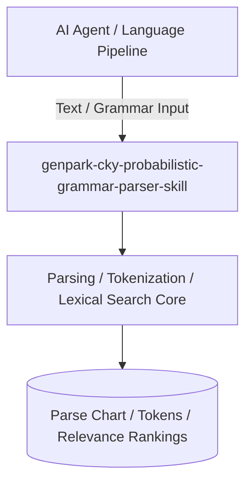

# genpark-cky-probabilistic-grammar-parser-skill

[](https://github.com/alphaparkinc/genpark-cky-probabilistic-grammar-parser-skill/actions)
[](https://opensource.org/licenses/MIT)
[](https://www.python.org/downloads/)

> Cocke-Younger-Kasami (CKY) dynamic programming chart parser for Probabilistic Context-Free Grammars (PCFGs) in Chomsky Normal Form.

## Architecture



## Features
- Pure standard library Python implementation with strictly zero pip dependencies.
- Fundamental computational linguistics and NLP algorithms (Earley, CKY, BPE, Beam Search, BM25).
- Native Model Context Protocol (MCP) server support for AI agent text intelligence.

## Installation

```bash
git clone https://github.com/alphaparkinc/genpark-cky-probabilistic-grammar-parser-skill.git
cd genpark-cky-probabilistic-grammar-parser-skill
```

## Quickstart

```bash
python example_usage.py
```
